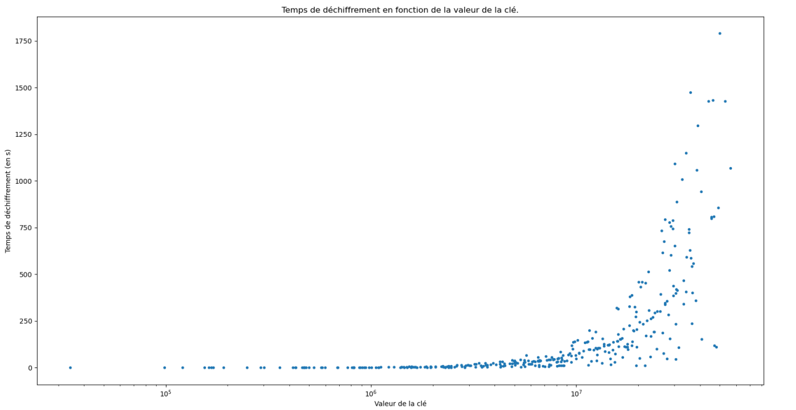
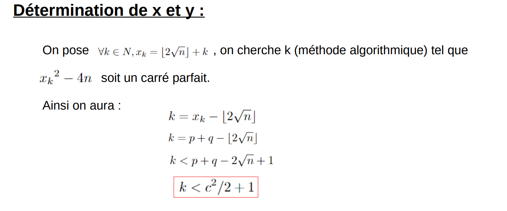

# PROJET TIPE - 2022

*Le but de ce projet était de mettre en évidence la complexité effective d'une méthode de chiffrement telle que le RSA.*

## Attaque classique de Fermat - Cas où p et q sont proches

